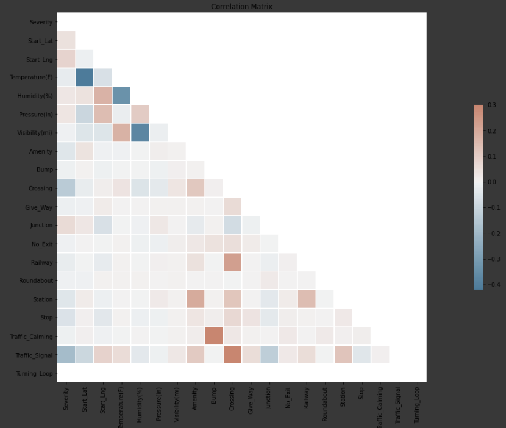
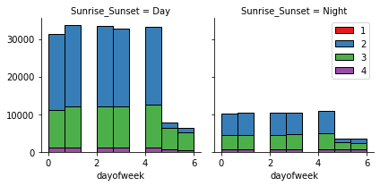
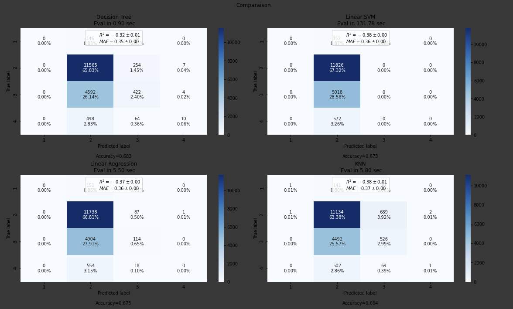

# Predicting car accidents severity in the US

# 1 Introduction
## 1.1 Background

The high death rate from road accidents is a major concern in today's society. An efficient and valid treatment is therefore of great importance for citizens and societies. Large efforts and studies have addressed the question of road safety. From year 1913 to year 2018 the was a 96% improvement in the death rate. The research is therefore actively participating in reducing mortality rate in roads. In this report we will be studying the car accidents severity in the US between 2016 and 2020.

## 1.2 Problem

The data we are using include date and time of the incidents, category of junction at which collision took place, the weather condition, and other parameters that describes the environment and the situation that led to the accident. This project aims to predict the severity of an accident based on these parameters.

## 1.3 Interest

The analysis will take into account different aspects and factors that can be valuable to car users to avoid and reduce accident risks.

# 2 Data Description

To analyse the problem i used these datas: A Countrywide Traffic Accident Dataset (2016 - 2020) from Kaggle [1]. The Data is collected using streaming reports on important traffic events. This data is captured by a variety of entities, such as the US and state departments of transportation, law enforcement agencies, traffic cameras, and traffic sensors within the road-networks. There are about 3.5 million accident records in this dataset. It includes, among others, detailed description about the incidents, wether conditions, category of junction at which collision took place.

# 3 Methodology
## 3.1 Data cleaning

There were a lot of missing values in many columns. I decided first to drop the columns if their missing values percentage exceed 30% of the total available data, because filling missing values fill on these columns will be irrelevent for the final use in the model. Then I performed missing values filling with last valid observation forward to next valid backfill.

There are several problems with the dataset. First, the type of datetime columns wasn’t right. I changed the type of this column, and extracted the date and time separately. From the new date column I extracted the day of week, and created a new column specifying if it is a weekend day or not.

## 3.2 Feature selection

After data cleaning, there were 351362 samples and 27 features in the data. Upon examining the meaning of each feature, it was clear that there was some redundancy in the features. For example, there was a feature of the Traffic_Signal, and another feature of the Crossing, with the difference being that the Traffic_Signal is the presence of road traffic signal, and Crossing is a node where both ways are crossing (footway and street, street and railway and so on). Moreover, I inspected the correlation of independent variables, and found that this pair was highly correlated (Pearson correlation coefficient > 0.9). This makes sense. From these highly correlated features, only one was kept. I decided to keep the Crossing feature.

I studied the relationship between the day of week and the severity, and the relationship between the time of the accident and the severity. 
I observed that the accidents are more likely to happen during the day (Figure 1), and there are less accidents in the weekend compared to the other week days, this can be explained by the fact that there is less working people and therefore less traffic during the weekend, and for the same reason the accidents are more rare during the night.

## 3.3 Predictive modeling

There are two types of models, regression and classification, that can be used to predict accident severity. Regression models can provide additional information on the probability of the severity, while classification models focus on the level of severity. Therefore, in this study, I carried out classification modeling.

I applied KNeighbors, Decision Tree, Random Forest, SVM, and LogisticRegression models to the dataset, using root mean squared error (RMSE) as the tuning and evaluation metric. For each model, hyperparameters were tuned using the same metric and cross validation. 

# 6 Conclusion
In this study, I analyzed the relationship between car accidents severity and biographic data. I identified dates, days of week, geographical location, day and night time among the most important features that affect an accident severity. I built classification models to predict the accidents severity. These models can be very useful in helping road officers in a number of ways. For example, it could help identify roads to secure and estimate the delay of accidents.

Models in this study mainly focused on neutral features. However, car types and road sizes might also contribute to accident severity. These informations are obviously more difficult to extract, but if optimized, could bring significant improvements to the models.

# 7 References

[1] [US Accidents](https://www.kaggle.com/sobhanmoosavi/us-accidents/metadata)

